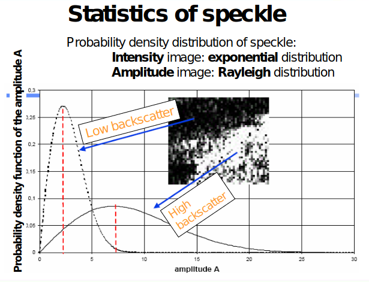

# Introduction to SAR Remote Sensing

## Introduction to Radar remote sensing

- __Passive sensors__: detect the reflected or emitted electromagnetic radiation from natural sources:
    - __non-imaging__: microwave radiometer, magnetic sensors
    - __imaging__: cameras, optical mechanical scanner, spectometer, microwave radiometer

- __Active sensors__: detect reflected responses from objects irradiated by artificially-generated energy sources
    - __non-imaging__: microwave radiometer, microwave altimeter, laser
    - __imaging__: Real Aperture Radar, Synthetic Aperture Radar

__RADAR__: Radio Detection and Ranging

__SLAR__: Side Looking Airborne Radar

__SAR__: Synthetic Aperture Radar

Radar remote sensing spectrum goes from wavelengths of 1m to 1cm:

| Frequency Band | Wavelength (cm) | Frequency (GHz) |
| :---: | :---: | :---: |
| K_a | 0.8 - 1.1 | 40 - 26.5 |
| K | 1.1 - 1-7 | 26.5 - 18 |
| K_u | 1.7 - 2.4 | 18 - 12.5 |
| X | 2.4 - 3.8 | 12.5 - 8 |
| C | 3.8 - 7.5 | 8 - 4 |
| S | 7.5 - 15 | 4 - 2 |
| L | 15 - 30 | 2 - 1 |
| P | 30 - 100 | 1 - 0.3 |


## Advantages of radar remote sensing compared to optical remote sensing

- all weather capability: small sensitivity of clouds and light rain


- day and night operation: independence of sun illumination

- no effects of atmospheric constituents: multitemporal analysis


- sensitivity to dielectric properties: water content, biomass, ice

- sensitivity to surface roughness: ocean wind speed


- accurate measurements of distance: interferometry


- sensitivity to man-made objects

- sensitivity to target structure: use of polarimetry


- subsurface penetration


## Disadvantages

- complex interactions: difficulty in understanding, complex processing

- speckle effects: difficulty in visual interpretation

- topographic effects


- effect of surface roughness

## Principle of imaging radar

The sensor transmits a pulse and detects the back-scattered signal.

## Side-Looking Airborne Radar


The __angular aperture__ of the antenna `theta` on the horizontal plane is:
```
theta = lambda / L

where:
    lambda = wavelength
    L = antenna length along the horizontal direction
```
the larger the antenna, the narrower the aperture.

The __azimuth resolution__ is `R_a`:
```
R_a = lambda * R / L

where: R = slant-range from the antenna to the target (depends on the height and the looking angle)
```

Numerical example:
```
L = 10m, R = 1000km (spaceborn), lambda = 5cm (C band)
R_a = 5km
```

## Synthetic Aperture Radar

An array of antennas is equivalent to a single antenna moving along the flight line `L_s` if the the received signals are coherently recorded and added, and the target is assumed to be static during the period.


The echoes from `X_1, X_2, ..., X_n` are recorded coherently.

The azimuth resolution `R_a` is:
```
R_a = L / 2

where L is the azimuth size of the single antenna
```

## Improvement of the range resolution

A frequency modulation for pulse compression is equivalent to a pulse of a shorter duration. If the pulse has a shorter duration, the range resolution is smaller.


## SAR image


## Geometric effects


(https://www.capellaspace.com/sar-101-an-introduction-to-synthetic-aperture-radar/)

- __Foreshortening__: because SAR is a side-looking ranging isntrument, the backscattered returns will be arranged in the image based on how far the target is from the antenna along the slant plane (radar-image plane).
In the figure above, the mountain between 1-2 is an example. The slope 1-2 is compressed in the slant plane because the radar signal reaches point 2 shortly after reaching point 1. In the image, the steep slope appears as a bright edge.
A larger looking-angle decreases the effect

- __Layover__: is an extreme example of foreshortening. The object is so tall that the radar signal reaches the top before reaching the bottom. An example is the slope 3-4. The returns from point 4 is place on the image closer to the sensor (near range) and obscure point 3. 

- __Shadow__: as well as in optical images: an object blocks the path of direct radiation. While in optical images it is possible to see objects in shadow due to atmospheric scattering, in SAR there is no information because there is no return signal


The effects depend on the sensor's look angle:
- a larger look angle increases the effects of shadows, decreases the effects of layover.
- a smaller look angle has the opposite effects. 


The geometrical artifacts related to the vision in range are:
- __shortening__ of the slopes facing the radar
- __stretching__ of the slopes oppositely oriented to the radar 


## Static properties of SAR measurements

The basic measurementmade by a SAR is a __complex image__ (amplitude and phase). Main types of images extracted are:
- amplitude image `A`
- intensity image `I = A^2`


- (the phase of a __single__ image has no information)


## Measurements from multipe images

- polarisation images derived from the complex image is the SAR system is polarimetric
- interferometric images
- multi-polarisation intensity images
- multi-temporal intensity images


## Radar cross-section

```
sigma_pq    = 4 * pi * |S_pq|^2 =
            = 4 * pi * R^2 * P_s / P_i  [m^2]

R : radar-target distance
P_i : incident power
P_s : power scattered by the target
``` 

For __ditributed targets__ each resolution cell contains many scatterers and the phase varies rapidly with position.

The differential __backscattering coefficient__ is:
```
sigma_0 = 4 * pi * R^2 / delta_A * P_s / P_i  [m^2 / m^2]

delta_A : is the area of the illuminated surface over which the phase can be considered constant.
```

## Speckle

The resolution cells are made up of many scatterers with different phases, leading to interference and the noise-like effect known as speckle.




Given `L` independent measurements from a uniform distributed target, the __maximum likelihood estimate__ of the backscattering coefficient is given by:
```
I = 1/L * sum_from k=1_to L_(I_k)

where I_k are the individual intensity measurements
```

`L` is called the __number of looks__.


## Physical content of SAR data

The image represents physical processes.

Pixels are measurements.

So the image is understandable based on the understanding of the physical processes.

## The radar scattering

The scattering matrix contains information on the nature and characteristics of the observed media.


## Scattering mechanisms

The backscattered signal results from:
- surface scattering
- volume scattering
- muliple volume-surface scattering

The relative importance of these contributions depend on:
- __surface roughness__ (with respect to the wavelength) governs the scattering pattern:
    - smooth surface: specular reflection -> low radar backscatter
    - rough surface: distributed scattering -> high radar backscatter

- __dielectric properties of the medium__ (i.e. moisture content) govern the strength of the backscatter:
    - dry medium `epsilon_1`
    - wet medium `epsilon_2 > epsilon_1`: the backscattering signal from a wetter medium is stronger. For example: irrigated fields produce a higher backscatter.

All these factors depend on:
- the radar frequency
- the polarisation
- the incidence angle


## Polarisation in surface scattering

- smooth surface -> no depolarisation. If V is transmitted, V is reflected. There is no HV or VH backscatter. The Fresnel reflectivity is `R_H > R_V`

- rough surface -> some depolarisation. If V is transmitted, H is returned. There is a HV or VH backscatter. The Fresnel reflectivity is `R_H = R_V`


## Volume scattering

For example, the main scatterers in a tree canopy are the elements having the dimension of the same order as the wavelength:
- X band (3cm): the main scatterers are the leaves
- L band (27cm): the main scatterers are the small branches
- P band (70cm): the main scatterers are the big branches
- VHF (>3m): the main scatterer is the trunk (the other parts are smaller and are not detected)


Types of volume scattering:
- point scatter: no depolarisation
- anisotropic scatter: depolarisation
- multiple scattering: depolarisation


The scattering with the vegetation can be:
- __order 0__ if interacts only with the soil
- __order 1__ if interacts with the vegetation and the soil
    - vegetation
    - soil -> vegetation
    - vegetation -> soil
    - soil -> vegetation -> soil (negligible)

So the total backscattering coefficient is:
```
sigma^0 = sigma^0_soil + sigma^0_veg + sigma^0_veg_soil
```


## Phase in SAR images

The SAR measurements are complex: they have an amplitude and a phase.

The SAR resolution cell contains a large number of scatterers.

The phase difference between scatterers of the incident wave travelling from the radar to a scatterer and back to the radar changes as:
```
delta_phi = 2 * pi * delta_r / lambda

where delta_r is the difference in travel distance
```

The phase seems randomly distributed so the phase of a single image is not useful.

If the scene is observed in 2 images, in which the scatterers remain unchainged in the resolution cell, the phase difference between pixels of the 2 images can be exploited.

- __Polarimetry__: the radar measures at the same time HH, VV, HV, VH and their phase difference

- __Interferometry__: two radars observe the scene with a small shift in the look angle; or the same radar at different dates from slightly shifted orbits. 