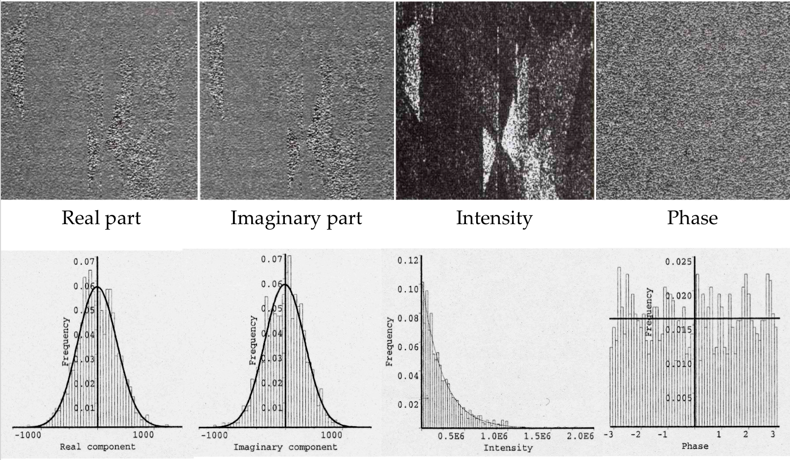
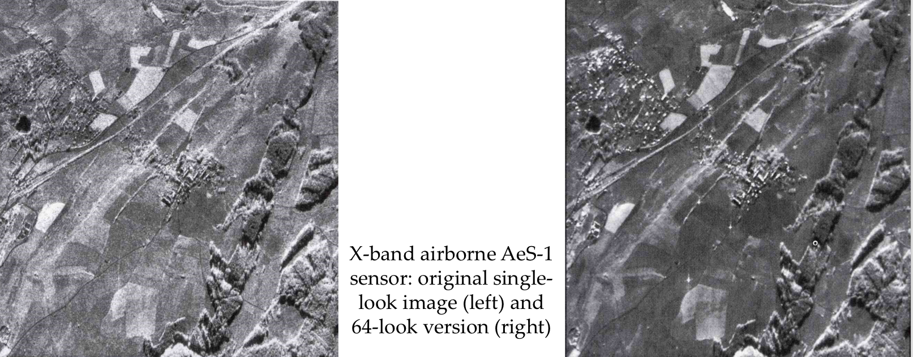
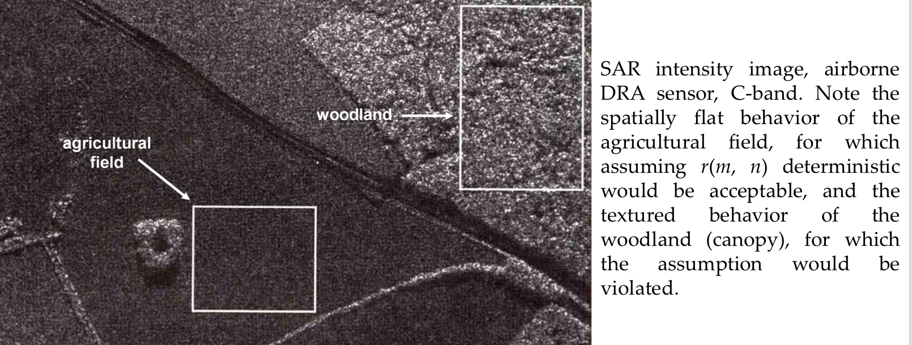

# Probabilistic model of radar data

We focus on a single pixel `(m,n)` of a __single-polarization radar image__.

The pixel value is `i(m,n)`. This value is proportional to the received power of the return signal.

The pixel `(m,n)` includes many points that scatter the signal, so the radar return signal is generated by a __distributed scattering__ process.

Simple model: the ground area related to this pixel is made of a large number of small __independent point scatters__. -> a single pixel is influenced by multiple contributions.

Optical vs Radar models:
- Optical: back scattered signal is gaussian because it is the sum of many contributions
- Radar: the in-phase and the in-quadrature components are gaussian for the same reason as the optical images, but the power has a different distribution.

For the __central limit theorem__, the in-phase and the in-quadrature components are __circular Gaussian__ (jointly Gaussian, uncorrelated, zero-mean, same variance):
- the intensity is exponential with mean `r(m,n)`
- the amplitude is Rayleigh
- the phase is uniform -> doesn't depend on the surface
- the intensity and the phase are independent

The phase is important in SAR interferometry / tomography: the phase difference of 2 radar images is used to estimate distances, slow movements of the terrain or height differences. The phase difference is correlated to the properties of the observed surface.



The __speckle__ is the stochastic process `s(m,n) = i(m,n) / r(m,n)`
- is exponential distributed
- unitary mean: `E{s(m,n)} = 1`

The __product model__ of the intensity of the back scattered signal is
```
i(m,n) = r(m,n) * s(m,n)
```

- `r(m,n)` is the signal that is correlated to the spatial variability of land cover and terrain
- `s(m,n)` has a fixed distribution uncorrelated to the observed surface. It derives from the distributed scattering process and acts as a multiplicative noise.


## Multilooking

A method for reducing the speckle in radar images: apply a moving average filter with a `w * w` window.

`L=w*w` is the __number of looks__ and the filtered images is called __multilook image__. The input image is called __single-look image__.

The issues of this method are:
- blurred edges
- degraded spatial resolution



By using the average filter centred on pixel `(m,n)`, we assume that the pixels within the window are i.i.d.:
- independent
- exponentially distributed with mean `r(m,n)`

The average of `L` independent exponential variables is Gamma with:
- mean `r(m,n)`
- shape parameter `L`

The __speckle variance__ is reduced by a factor `1/L`. 

If the independency assumption doesn't hold:
- the shape parameter is not integer but a real value and is estimated from the image -> __equivalent number of looks__ (ENL)


Alternate formulatations:

- __mosaic averagin__: 2x2 blocks of adjacent pixels can be averaged together to generate a 4-look image with a spatial resolution degraded by a factor 2.


## Texture model

The signal `r(m,n)` can be modelled as a deterministic signal where the image intensity is uniform.

The signal `r(m,n)` in the product model can be modelled as a stochastic process that characterizes the texture image region.




## General formulation of the product model

The product model is accepted for the pixel statistics of any radar intensity image in both textured and non-textured areas.
```
i(m,n) = r(m,n) * s(m,n)
```

- the speckle `s(m,n)` is Gamma with unitary mean and shape parameter `L`. It acts as multiplicative noise.

- the signal `r(m,n)` is a stochastic process that characterizes the spatial variability and the texture of the observed surface.

- the 2 processes are independent

Hence, the conditional pdf of `i(m,n)` given `r(m,n)` is Gamma with mean `r(m,n)` and shape parameter `L`.

So the intensity pdf of `i(m,n)` is:
```
p_mn(i) = integral_0^+inf p(i|r) p_mn(r) dr
```


## Speckle reduction methods

- __Lee, Kuan, Frost filter__: based on on the minimum mean square error criterion. It is based on the linear regression of `r(m,n)` from `i(m,n)` and the sample-mean and sample-variance of `i(m,n)` are estimated locally from the image with a moving window.
    - is an adaptive filter since its parameters changes across the image
    - can be applied multiple times
    - assumes that pixels within the window are i.i.d. to estimate the sample mean and variance
    - independence is not realistic
    - identical distribution is satisfied only in homogeneous regions, but not across the edges -> produces blurred edges and artifacts.

- __Bayesian filters__: apply the Bayesian estimation theory to the pdf models.

- __Wavelet-domain fitlers__: use multiscale wavelet transforms

- __Probabilistic model-based filters__: use stochastic models (continuous valued Markov random fields) for the input radar image

- __Variational filters__: use discretized versions of suitable partial differential equations (e.g. the speckle-reducing anisotropic diffusion filter)

- __Non-local means filters__: replace the moving window by an appropriate sampling across the image to reduce the blurring effect.