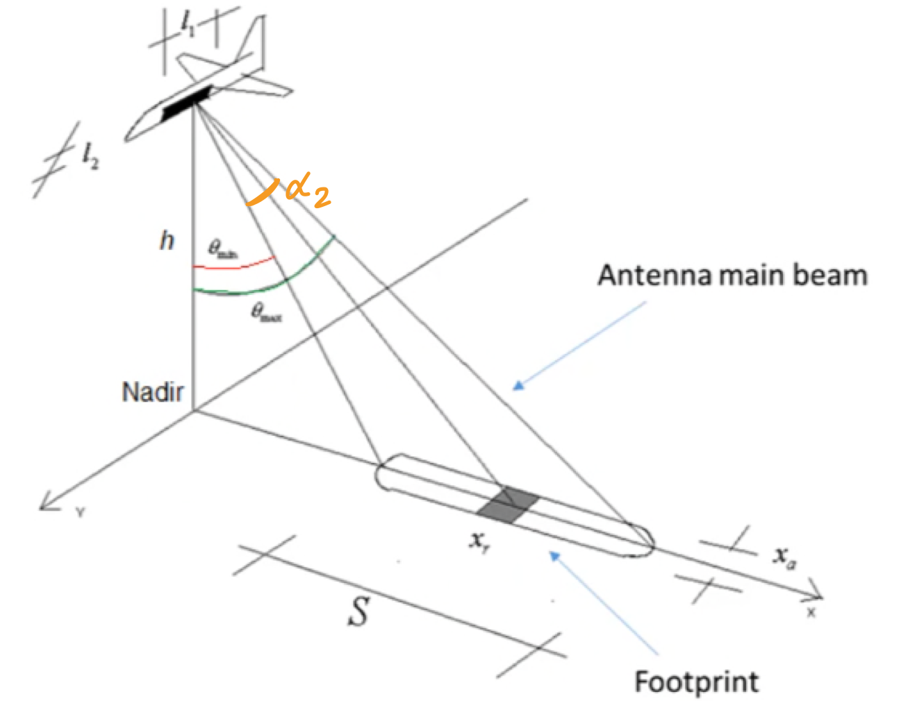
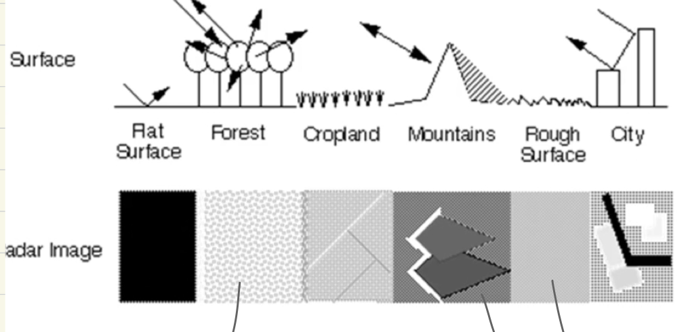

# Radar

Non-imaging radar is used in applications for detecting the presence of a point target or measuring the distance.

## For remote sensing
In remote sensing:

- the antenna is mounted on a satellite or airplane.

- the main beam of the radar antenna is directed on a __distributed target__ (earth surface) -> so only a portion of the target is detected by the antenna.

- the footprint depends on the main lobe of the TX antenna.

- the RCS (radar cross section) is the mean value of the different materials composing the target included in the footprint. Usually the RCS is normalized to the footprint area.

The __dispersion property__ of a material depends on strongly on the frequency: at different frequencies, materials exhibit different dielectric parameters, so different interactions with the e-m radiation.

If the footprint would depends only on the antenna dimension, the pixel dimension would be too large for practical applications.

## SLAR - Side Looking Aperture Radar



- Swath: `S = h * ( tan(theta_max) - tan(theta_min) )`
- Antenna aperture: `alpha_2 = theta_max - theta_min`
- for an aperture antenna `L_1 x L_2` with a non-symmetric main lobe `alpha_2 = lambda / L_2`


## Range resolution

The radar illuminates the target with a pulse of duration `tau`.

The echoes produced at different distances from nadir are received after different delays. Echoes produced by points closer to the nadir are received before than echoes received from far points.

The range resolution is the minimum distance such that two targets are detected separately, that is two distinct echoes are received. So the receiving instant times of the two echoes must be at least `tau`.


- The echo of A is received after a time `t`
- The echo of B is received after a time `t + delta_T`, where:
```
delta_T = 2 * KB / c = 2 * x_r * sin(theta) / c
```

The condition of two non-overlapping echoes is `delta_T >= tau`, so the range resolution is:
```
x_r = ( c * tau ) / ( 2 * sin(theta) )
```

This is the pixel resolution along x.

So the radar uses the delay of the received echo to obtain more than 1 pixel in a footprint.

The dimension of the pixel depends on `theta`:

- the pixels are larger for small values of `theta` (near Nadir)

- the pixels are smaller for large values of `theta` (far from Nadir)

- at Nadir, the pixel resolution would be infinite `theta -> 0 => x_r -> inf`

- if `theta` is too large, the power of the echo signal is very weak.

So it is necessary a trade-off between resolution and echo power.


## Azimuth resolution

It is the resolution parallel to the flight direction.

It is not possible to exploit the delays of the echo signals.

So the azimuth resolution is fixed by the aperture of the antenna on that plane. The __half-power beamwidth__ is:
```
alpha_1 = lambda / L_1
```

Usually `L_1 > L_2 => alpha_1 < alpha_2`


```
x_a = CD = 2 * CQ 
    = MQ * tan(alpha_1 / 2)
    ~ MQ * alpha_1
    ~ MQ * lambda / L_1

MQ = h / cos(theta)

-> x_a = ( lambda * h ) / ( L_1 * cos(theta) ) 
```

In the azimuth resolution:

- pixels are smaller for small theta (near Nadir)
- pixels are larger for large theta (far from Nadir) (opposite to range resolution)
- depends on the height so that is not applicable to satellites


## SAR - Synthetic Aperture Radar

The antenna array collects an array of signals.

If the paths of the various signals have the same lengths, all the signals arrive at the adder with the same phases:
```
s_1 + r_1 = ... = s_N + r_N
```


- The main lobe is steered towards point P: the antenna optimally receives from point P; signals received from different points with different phases cancel out.

- If P is at infinite distance from the array, the array is said __focused at infinite / not-focused__

- It is possible to steer the pointing direction of the array by changing the phase shift of each antenna: `s_1, ..., s_N`.


A linear array behaves like a single antenna of dimension `L x L_2` where
```
L = (N-1) * d ~ N * d
```

`d` is the distance between the array elements


The main lobe beamwidth in the azimuth direction is:
```
alpha_array = lambda \ L
```

So if `L` is large, `alpha_array` is very small -> good azimuth resolution.

`N` antennas forming an array behaves like a single very large antenna.

However, the size of the antenna is constrained, but it is possible to obtain the same behaviour of an array antenna using a single array element antenna:

- the single array element occupies the array locations at different times

- the power measurement is stored for each array position; when all the array positions have been covered, the measurements are summed.


The same synthetic array antenna is used both for TX and RX, so that the beampatterns are combined and the resulting beampattern is the same as that of an antenna large `2 * L`:
```
alpha_SAR = lambda \ ( 2 * L )
```

__SAR azimuth resolution__ is:
```
x_a = ( lambda * h ) / ( 2 * L * cos(theta) )
```

But `L`, the array dimension is constrained by the azimuth resolution a the single antenna:
- a point P on the surface is illuminated by the main lobe of the real antenna for a distance `x_a = L`


```
x_a = ( lambda * h ) / ( 2 * L * cos(theta) )
    ~ ( lambda * h ) / ( 2 * ( (lambda * h) / (L_1 * cos(theta)) ) * cos(theta) )
    = L_1 / 2
```

The azimuth resolution of a SAR:

- is independent of the altitude `h`
- is smaller if the antenna size `L_1` is smaller -> feasible on a satellite

However, there is a trade-off between the antenna size and the minimum power detected.


